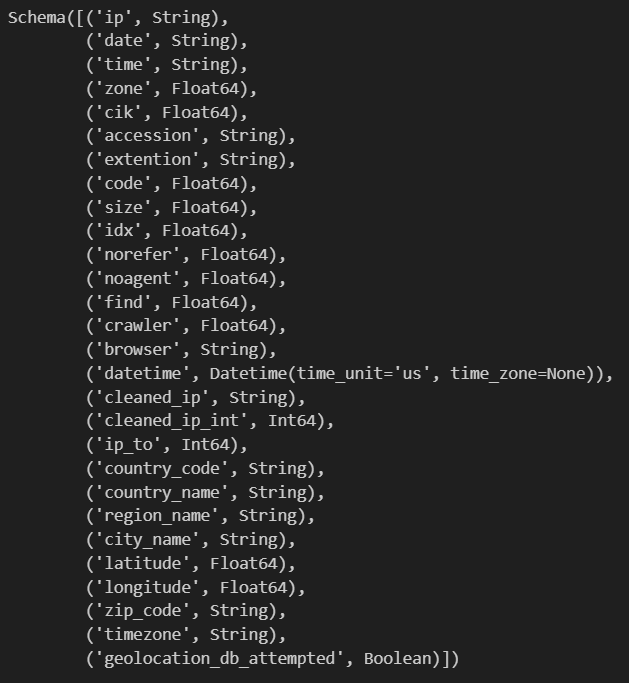
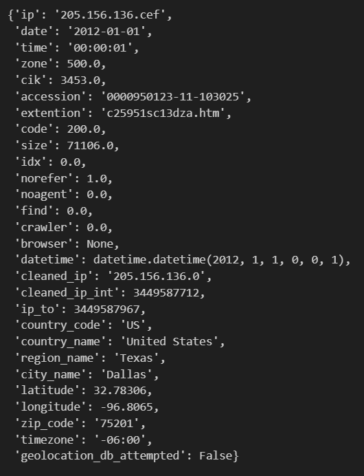

# SEC Edgar Log Files Processor

A web scraping and data processing tool that extracts, processes, and analyzes SEC Edgar log files using Python, Selenium, and data visualization tools.

## Table of Contents
- [Overview](#overview)
- [Installation](#installation)
- [Usage](#usage)
  - [Running the Log Processor](#running-the-log-processor)
  - [Data Processing Pipeline](#data-processing-pipeline)
  - [Directory Structure](#directory-structure)
- [Notes](#notes)
  - [Setting up ChromeDriver](#setting-up-chromedriver)

## Overview
This project processes SEC Edgar log files using **Python** and **Selenium**, then analyzes and visualizes the data:
✅ Downloads and processes SEC Edgar log files
✅ Filters out bot traffic using RPV conditions
✅ Enriches IP addresses with geolocation data
✅ Provides cleaned and standardized data for analysis

## Example Output
- Schema
<br>

- Sample Data
<br>


## Installation

### 1. Clone the repository
```bash
git clone https://github.com/yourusername/sec-edgar-log-files.git
cd sec-edgar-log-files
```

### 2. Create the conda environment
```bash
conda env create -f conda.yml
conda activate sec_edgar
```

### 3. Set up ChromeDriver
Follow the [Setting up ChromeDriver section](#setting-up-chromedriver) to install and configure it properly.

## Usage

### Running the Log Processor
Use the following command:

```bash
python scripts/extract_edgar_logs.py --start-date <start_date> --end-date <end_date> --force
```

#### Arguments
- `--start-date` (Required)
    - Start date for processing logs (YYYY-MM-DD format)
- `--end-date` (Optional)
    - End date for processing logs (YYYY-MM-DD format)
    - If not provided, processes only the start date
- `--force` (Optional)
    - Force reprocessing of existing files
    - When specified, reprocesses all files regardless of existence

**Example Usage**
```bash
# Process logs for a single date
python scripts/extract_edgar_logs.py --start-date 2024-03-20

# Process logs for a date range
python scripts/extract_edgar_logs.py --start-date 2024-03-01 --end-date 2024-03-20

# Force reprocess existing files
python scripts/extract_edgar_logs.py --start-date 2024-03-01 --end-date 2024-03-20 --force
```

#### Output
- Processed data is saved in:
    - `downloads/*.zip` - Downloaded ZIP files
    - `extracted/*.csv` - Extracted CSV files
    - `converted/*.parquet` - Converted Parquet files
    - `no_bots/*.parquet` - Filtered data without bot traffic
    - `output/*.parquet` - Final processed data

### Data Processing Pipeline
1. **Download**: Retrieves ZIP files from SEC Edgar website
2. **Extraction**: Extracts CSV files from ZIP archives
3. **Conversion**: Converts CSV to Parquet format
4. **Cleaning**: 
    - Filters out non-200 responses
    - Removes bot traffic based on RPV conditions
    - Cleans IP addresses to standard format
5. **IP Enrichment**:
    - Adds geolocation information
    - Standardizes country names
6. **Output**: Produces cleaned and enriched Parquet files

### Directory Structure
```
project_root/
├── downloads/          # Downloaded ZIP files
├── extracted/         # Extracted CSV files
├── converted/         # Converted Parquet files
├── no_bots/          # Filtered data without bot traffic
│   └── ip_enriched/  # IP-enriched data
├── output/           # Final processed data
└── tmp/             # Temporary files
```

## Notes
- Ensure your **Chrome version** matches the ChromeDriver version
- Modify `scripts/lib/sec_edgar.py` to customize the processing logic
- The RPV (Requests, Pages, and Volume) conditions for bot filtering are based on research from Lee et al. (2019) "Detecting Abnormal Machine Downloads on EDGAR":
  - R: More than 25 requests per minute from the same IP address
  - P: Access to more than 3 unique company CIKs per minute from the same IP
  - V: More than 500 total requests from the same IP in a day
  These thresholds help identify automated/bot traffic patterns while preserving legitimate human access

### Setting up ChromeDriver
#### 1. Installing Chrome:
```bash
# For Windows
# Download Chrome from https://www.google.com/chrome/
# Install the downloaded .exe file

# For Linux
sudo apt-get update
sudo apt-get install -y curl unzip xvfb libxi6 libgconf-2-4

wget https://dl.google.com/linux/direct/google-chrome-stable_current_amd64.deb
sudo apt install ./google-chrome-stable_current_amd64.deb
rm ./google-chrome-stable_current_amd64.deb

google-chrome --version
```

#### 2. Install ChromeDriver:
1. Find the latest ChromeDriver version: [Chrome for Testing](https://googlechromelabs.github.io/chrome-for-testing/)
2. Download and install:
```bash
# For Windows
# Download the appropriate ChromeDriver version
# Extract and add to PATH

# For Linux
wget https://storage.googleapis.com/chrome-for-testing-public/<<VERSION>>/linux64/chromedriver-linux64.zip

unzip chromedriver-linux64.zip
sudo mv chromedriver-linux64/chromedriver /usr/bin/chromedriver
sudo chown root:root /usr/bin/chromedriver
sudo chmod +x /usr/bin/chromedriver

rm chromedriver-linux64.zip
rm -r chromedriver-linux64
```

## License
This project is licensed under the MIT License - see the LICENSE file for details.

## Acknowledgments
- SEC Edgar for providing the log files
- Country Converter for country name standardization
- IP2Location for geolocation data

